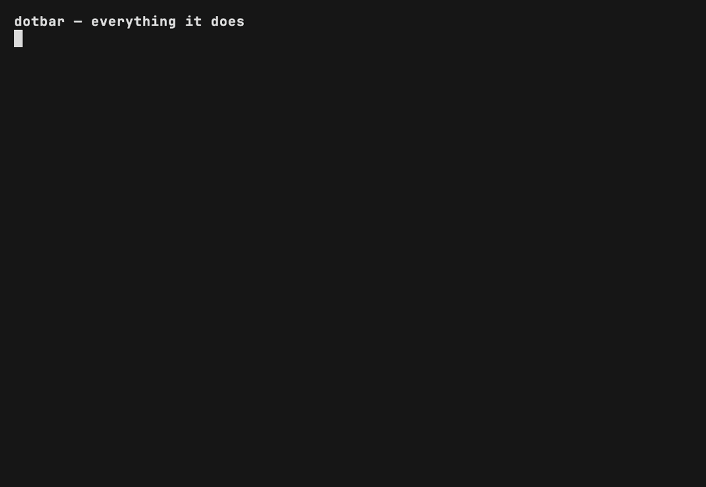

# dotbar

A braille-dot progress bar for statuslines and terminals.



<!-- An animated GIF, not the mp4, because GitHub strips <video> and renders a
     bare .mp4 URL as a plain link. The same recording as
     [.github/dotbar.mp4](.github/dotbar.mp4), which is smaller and seekable.
     Regenerate both with:
       cp demo/dotbar-braille.ttf ~/Library/Fonts/
       nix run nixpkgs#vhs -- demo/dotbar.tape
     The content is demo/tour.sh, which is also runnable on its own. -->

```
dotbar 76            ⣿⣿⣿⣿⣿⣿⣿⣿⣿⡿⣀⣀⣀ 76%   (13 cells, 1% per dot)
dotbar --dense 76    ⣿⡿⣀ 76%                (3 cells, 5% per dot)
dotbar demo          animate 0 -> 100% over 5s
dotbar demo-slow     animate 0 -> 100% at 1%/s
```

With no percent argument it reads Claude Code statusline JSON on stdin and
renders `100 - .context_window.remaining_percentage`. No such field means no
output and exit 0, so a statusline segment with no data vanishes rather than
printing an error.

Cells ramp green to red left to right. `NO_COLOR=1` drops every escape
sequence, for consumers that render the output as literal text.

Any other first argument is dispatched git-style to `dotbar-<subcommand>`,
preferring a sibling of the `dotbar` binary over `$PATH`.

## Install

```
brew install tlehman/tap/dotbar
```

Or from source, which needs a Rust toolchain (`brew install rust`):

```
cargo install --git https://github.com/tlehman/dotbar
```

The tap's formula is kept in this repo at
[packaging/homebrew/dotbar.rb](packaging/homebrew/dotbar.rb); the tap repo is
`tlehman/homebrew-tap`, and `brew install --HEAD tlehman/tap/dotbar` builds
main.

## Develop

`devenv shell` (trust once with `devenv allow`), then `devenv test` for the
full contract: toolchain present, `cargo clippy -D warnings`, `cargo test`.

Panic-capable constructs are denied in production code (`Cargo.toml`
`[lints.clippy]`) and allowed in tests (`clippy.toml`).

## License

MIT OR Apache-2.0.
